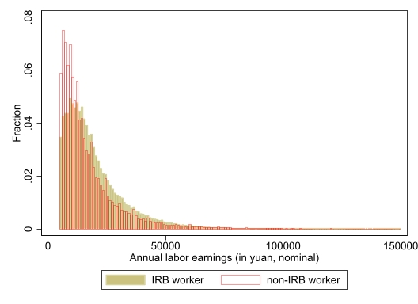
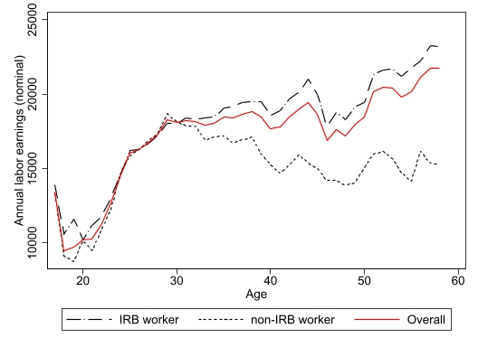

```{r setup, include=FALSE}
knitr::opts_chunk$set(echo = FALSE)

# Learn more about creating websites with Distill at:
# https://rstudio.github.io/distill/website.html

# Learn more about publishing to GitHub Pages at:
# https://rstudio.github.io/distill/publish_website.html#github-pages

```

English name: Peter Xue    
Email: [peterxue1024\@stu.pku.edu.cn](mailto:peterxue1024@stu.pku.edu.cn){.email}.

<!-- Hi, I'm Peter RL Xue. My Chinese name is 鎔荔(Rong-Li). Currently, I am a master student in Economics at Peking University HSBC Business School (expected to graduate in July 2024) and applying to PhD programs/RA positions. I built the website for application purpose. -->


<!-- ### Personal -->
<!-- I have lived in Shanghai for more than 20 years (born and raised). In my spare time I like walking and exploring maps of big cities. -->


### Work in progress

- **"Financial frictions, work effort, and labor market fluctuations", 2023.**   
<a href="https://drive.google.com/file/d/1H4hiwUU2_UYPO3c35_YgsZdhoxBb_tAN/view?usp=sharing" target="_blank">draft</a>
&nbsp;

Abstract: I study how financial frictions and work effort affect labor market fluctuations in a dynamic general equilibrium model with standard DMP-type labor market frictions. Firms are subject to investment adjustment costs and limited enforcement constraints while workers are allowed to endogenize their labor effort through bargaining protocols though they are randomly matched to firms that are able to decide vacancy postings. My benchmark model (with flexible wage) is able to restore the negative slope of the Beveridge curve and account for about 38 percent of fluctuations in labor market tightness and 65 percent of fluctuations in job vacancies observed in the quarterly U.S. data. 


- **"'Iron rice bowl' and earnings differentials in China", 2023.**
&nbsp;

Abstract: I combine China’s national urban household survey (UHS) data with income tax and social security contribution rule from 1986-2014 to study the labor earning outcomes of "iron rice bowl" (IRB) workers (i.e., state-employed workers in government or communist party organizations, public institutions, or state-owned enterprises with low unemployment risk). Preliminary results show that IRB workers with similar observable characteristics tend to earn 293.4 yuan (in 1986 price level) more than their non-IRB counterparts per year during 2002-09. The wage gap between IRB and non-IRB workers increased significantly after age 30.

Annual labor earning distribution |  Annual labor earning by age
:-------------------------:|:-------------------------:
{height=70% width=95% }   |  {height=70% width=95% } 


### Others

| Item              | description                                                                                                                    |
|:---------------------------|:------------------------------------------|
| Coding sample         | <a href="https://github.com/peterrlx/sample_code" target="_blank"> link</a> |
| Past independent projects:         |  <a href="https://drive.google.com/file/d/1G_X22uu-9QdNE50H_QW9FrLMKLe4KOkv/view?usp=sharing" target="_blank">sample1</a>, <a href="https://drive.google.com/file/d/1GPvjEODmJtdpk71JMkg0Q2NuG8-VcVHR/view?usp=drive_link" target="_blank">sample2</a>, <a href="https://drive.google.com/file/d/19asOzVFF6qKCUHThvbtT5yT3xn3VPeSi/view?usp=sharing" target="_blank">sample3</a>, |

